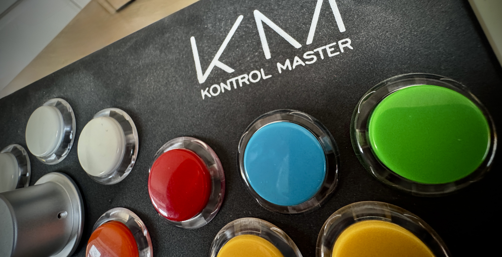

# Kontrol Master MIDI

> **Still have a Kontrol Master from Touch Innovations?** This project brings it back to life as a fully functional USB MIDI controller.



The **Kontrol Master** was a desktop controller created by [Touch Innovations](https://www.touchinnovations.com/) in 2016/2017. When the original electronics stopped working or software support ended, many units ended up in drawers.

This project provides replacement firmware using a **SparkFun Pro Micro** board — giving your Kontrol Master hardware a second life as a modern USB MIDI controller. No drivers needed, works with any MIDI software.

## Table of Contents

1. [Step 1: Check if Your Kontrol Master is Alive](#step-1-check-if-your-kontrol-master-is-alive)
2. [Step 2: Download This Project](#step-2-download-this-project)
3. [Step 3: Install Arduino IDE](#step-3-install-arduino-ide)
4. [Step 4: Set Up Arduino](#step-4-set-up-arduino)
5. [Step 5: Upload the Firmware](#step-5-upload-the-firmware)
6. [Step 6: Test with MIDI Monitor](#step-6-test-with-midi-monitor)
7. [Step 7: Configure Your Software](#step-7-configure-your-software)
8. [Reference: Button & Encoder Mapping](#reference-button--encoder-mapping)

---

## Step 1: Check if Your Kontrol Master is Alive

Before doing anything else, let's make sure your Kontrol Master is actually working.

### On macOS:

1. Plug your Kontrol Master into your Mac via USB
2. Click the **Apple menu ()** → **About This Mac**
3. Click **More Info...** → scroll down and click **System Report...**
4. In the left sidebar, click **USB**
5. Look for a device called **"SparkFun Pro Micro"** or similar

**If you see it:** Great! Your device is alive and your Mac recognizes it. Continue to Step 2.

**If you don't see it:** Try a different USB cable or USB port. Some cables are charge-only and don't transfer data.

---

## Step 2: Download This Project

You need to get the code from this page onto your computer. Here's the easiest way:

1. At the top of this page, click the green **Code** button
2. Click **Download ZIP**
3. Find the downloaded file (probably in your Downloads folder) called `kontrol-master-midi-main.zip`
4. Double-click it to unzip — you'll get a folder called `kontrol-master-midi-main`
5. Move this folder somewhere you can find it (like your Desktop or Documents)

---

## Step 3: Install Arduino IDE

Arduino IDE is the free app we'll use to upload the firmware to your Kontrol Master.

1. Go to https://www.arduino.cc/en/software
2. Download **Arduino IDE** for your operating system (macOS, Windows, or Linux)
3. Install it like any other app
4. Open Arduino IDE

---

## Step 4: Set Up Arduino

Before we can upload to the Kontrol Master, we need to tell Arduino IDE about the SparkFun board and install a helper library.

### 4.1: Add SparkFun Board Support

1. In Arduino IDE, go to **Arduino IDE → Settings** (on Mac) or **File → Preferences** (on Windows)
2. Find the field called **Additional Boards Manager URLs**
3. Paste this URL:
   ```
   https://raw.githubusercontent.com/sparkfun/Arduino_Boards/main/IDE_Board_Manager/package_sparkfun_index.json
   ```
4. Click **OK**

### 4.2: Install SparkFun AVR Boards

1. Go to **Tools → Board → Boards Manager**
2. In the search box, type **SparkFun AVR**
3. Find **SparkFun AVR Boards** and click **Install**
4. Wait for it to finish, then close the Boards Manager

### 4.3: Install MIDIUSB Library

1. Go to **Tools → Manage Libraries**
2. In the search box, type **MIDIUSB**
3. Find **MIDIUSB** by **Arduino** and click **Install**
4. Close the Library Manager

---

## Step 5: Upload the Firmware

Now let's put the firmware onto your Kontrol Master!

### 5.1: Open the Project

1. In Arduino IDE, go to **File → Open**
2. Navigate to the folder you downloaded in Step 2
3. Open the file: `KontrolMaster_MIDI` → `KontrolMaster_MIDI.ino`

### 5.2: Select the Board

1. Make sure your Kontrol Master is plugged in via USB
2. Go to **Tools → Board → SparkFun AVR Boards → SparkFun Pro Micro**
3. Go to **Tools → Processor → ATmega32U4 (5V, 16MHz)**
4. Go to **Tools → Port** and select the port that mentions "usbmodem" (on Mac) or "COM" (on Windows)

### 5.3: Upload

1. Click the **Upload** button (the arrow icon →) in the top-left
2. Wait for the progress bar at the bottom
3. When you see **"Done uploading"** — you're done!

If you get an error, double-check that you selected the right Board, Processor, and Port in the Tools menu.

---

## Step 6: Test with MIDI Monitor

Let's verify that your Kontrol Master is sending MIDI signals to your computer.

### On macOS:

1. Download **MIDI Monitor** from https://www.snoize.com/midimonitor/ (it's free)
2. Open MIDI Monitor
3. Go to the **Sources** menu and check your device (look for "SparkFun Pro Micro")
4. Press a button on your Kontrol Master — you should see messages appear!
5. Turn the rotary encoder — more messages should appear

**What you should see:**
- Button press: `Note On, Channel 1, Note 55, Velocity 127`
- Button release: `Note Off, Channel 1, Note 55, Velocity 0`
- Encoder turn: `Control, Channel 1, Controller 1, Value 0` then `Value 127`

If you see messages when you press buttons and turn the encoder, everything is working! You're ready to configure your software.

---

## Step 7: Configure Your Software

Now that your Kontrol Master is sending MIDI signals, you can use it with any software that supports MIDI input.

### Option A: BetterTouchTool (macOS)

BetterTouchTool lets you map MIDI signals to any action on your Mac — control volume, launch apps, trigger keyboard shortcuts, and more.

**Setting up:**
1. Open BetterTouchTool Preferences
2. Go to **Automations & Named & Other Triggers** in the left sidebar
3. Click **+** → **MIDI Trigger**
4. Your controller should appear as "SparkFun Pro Micro"

**Example: Use the encoder for volume control**
1. Add a new MIDI trigger
2. Set the rotary knob to **Command 191**
3. Set **Control Number 1** → **Volume Down**
4. Set **Control Number 2** → **Volume Up**

**Example: Use a button to show/hide an app**
1. Add a new MIDI trigger
2. Press a button on your Kontrol Master — BTT will detect it
3. Set the action to **Toggle Application Visibility** → select an app (e.g., Spotify)

### Option B: Logic Pro, Ableton, or Other Music Software

Most music software automatically detects MIDI controllers. Look for a MIDI or controller settings menu and your Kontrol Master should appear as "SparkFun Pro Micro".

### Option C: Any MIDI-Compatible Software

The Kontrol Master shows up as a standard USB MIDI device. If your software supports MIDI input, it should work!

---

## Reference: Button & Encoder Mapping

This section shows which MIDI signals each button and the encoder send. Use this when configuring your software.

### Buttons

All buttons send on **MIDI Channel 1** with velocity 127.

| Button Color | MIDI Note | Note Name |
|--------------|-----------|-----------|
| Orange 1     | 48        | C3        |
| Orange 2     | 49        | C#3       |
| White 1      | 50        | D3        |
| White 2      | 51        | D#3       |
| White 3      | 52        | E3        |
| Yellow 1     | 53        | F3        |
| Yellow 2     | 54        | F#3       |
| Red          | 55        | G3        |
| Blue         | 56        | G#3       |
| Green        | 57        | A3        |

### Encoder (Rotary Knob)

The encoder sends Control Change (CC) messages on **MIDI Channel 1**:

| Direction         | CC Number | Behavior        |
|-------------------|-----------|-----------------|
| Clockwise (right) | CC#1      | Pulses 0 → 127  |
| Counter-clockwise | CC#2      | Pulses 0 → 127  |

---

## Hardware Reference

If you're curious about the internals:

- **Board:** SparkFun Pro Micro (ATmega32U4)
- **Buttons:** 10 momentary push buttons (active low, common ground)
- **Encoder:** 1 rotary encoder with quadrature output

### Pin Mapping (for developers)

| Button Color | Wire Color | Pin |
|--------------|------------|-----|
| Orange 1     | Purple     | 9   |
| Orange 2     | Orange     | 10  |
| White 1      | Black      | 8   |
| White 2      | Grey       | 6   |
| White 3      | White      | 7   |
| Yellow 1     | Yellow     | A0  |
| Yellow 2     | Brown      | A1  |
| Red          | Red        | 16  |
| Blue         | Blue       | 14  |
| Green        | Green      | 15  |
| Encoder A    | Green      | 0   |
| Encoder B    | Yellow     | 1   |
